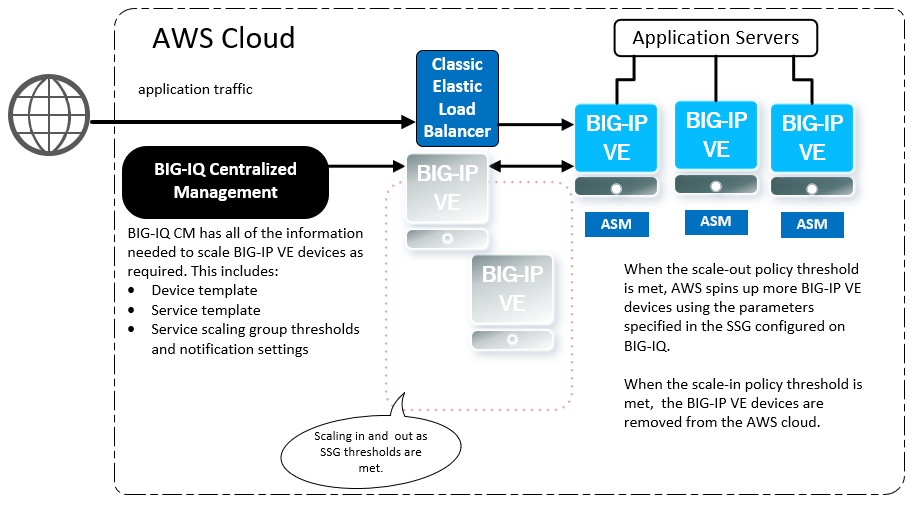

BIG-IP® Cloud Edition Trial Quick Start
=======================================

F5® [BIG-IP® Cloud Edition](https://www.f5.com/pdf/products/f5_bigip_cloud_edition_solution_overview.pdf): Automatically deploy pre-built app services dedicated to each application.

With F5® BIG-IQ® Centralized Management (CM), you can securely manage traffic to your applications in AWS by using what F5 calls a Service Scaling Group (SSG).

From a centralized view, you can monitor the health and statistics of your applications as well as devices that are load balancing traffic and hosting applications. You can also set up alert thresholds to immediately notify you of certain events.

This CloudFormation Template (CFT) creates two BIG-IQ VE instances: a BIG-IQ CM instance to configure and orchestrate instances of BIG-IP VE, and a BIG-IQ Data Collection Device (DCD) to store analytics data. The CFT also creates an Apache demo web server. 

After you configure the BIG-IQ instances, BIG-IQ automatically launches a BIG-IP VE instance in AWS.



Instructions for AWS
--------------------

To deploy this CFT in AWS, complete the following steps.

**Note:** This template is not supported in the Paris region and in AWS GovCloud.

1. To get a BIG-IQ trial license, go to [F5 Cloud Edition Trial](https://f5.com/products/trials/product-trials).
   Select **BIG-IP Cloud Edition - Advanced Web Application Firewall**

2. Subscribe and accept the terms for these F5 products:

   * [F5 BIG-IP Cloud Edition (BYOL)](https://aws.amazon.com/marketplace/pp/B07DR2WGJJ)
   * [F5 BIG-IP Virtual Edition - BEST (BYOL)](https://aws.amazon.com/marketplace/pp/B00KXHNAPW)

3. Launch the *trial stack* template by right-clicking this button and choosing **Open link in new window**:

   coming soon...

4. In the CloudFormation Template (CFT), populate this information:

   * Stack name (must be fewer than 25 characters)
   * Subnets in each availability zone (AZ1 and AZ2) (ensure they are not the same)
   * If you did not do it previously, accept the BIG-IQ and BIG-IP license terms by visiting the URLs specified, clicking **Continue to Subscribe**, and accepting terms
   * BIG-IQ Amazon Machine Image (AMI) IDs
   * License Keys BIG-IQ 1 and 2 (from F5 trial, used for the BIG-IQ CM and DCD instances)
   * License Pool BIG-IP (from F5 trial *BIG-IP VE Trial, Adv WAF, Per App VE, 3 Instances*, used for the SSG)
   * SSH Key (your AWS key pair name)
   * SSG CloudFormation Stack Name

   *Expected time: ~5 min*

5. Open the [EC2 console](https://console.aws.amazon.com/ec2/v2/home) and wait until the BIG-IQ instances are fully deployed.

   * Instance State: running
   * Status Checks: 2/2 checks passed

   *Expected time: ~5 min*

6. Use your key to SSH into the BIG-IQ DCD instance and execute the following commands:

   ```
   # bash
   # /config/cloud/setup-dcd.sh
   ```

   * When prompted, enter a password for BIG-IQ. You will use this same password again on the BIG-IQ CM instance. [Details on prohibited characters](https://support.f5.com/csp/article/K2873).
   * Let the scripts finish before moving to the next step.

   *Expected time: ~2 min*

7. Use your key to SSH into the BIG-IQ CM instance and execute the following commands:

   ```
   # bash
   # /config/cloud/setup-cm.sh
   ```

   * Enter the [AWS access key ID/secret key](https://docs.aws.amazon.com/general/latest/gr/managing-aws-access-keys.html) (used for the Service Scaling Group object creation) and BIG-IQ password.
   * The password must match the password you used on the BIG-IQ DCD instance in the previous step.
   * Let the scripts finish before moving to the next step.

   *Expected time: ~25 min*

8. Open BIG-IQ CM in a web browser by using the public IP address with https, for example: ``https://<public_ip>``

   * Use the username `admin`.
   * Click the Applications tab > APPLICATIONS. An application demo protected with an F5 Web Application Firewall (WAF) is displayed.
   * You can manage the Service Scaling Group by clicking the Application tab > ENVIRONMENTS > Service Scaling Groups.

For more information, go to [the BIG-IP Cloud Edition Knowledge Center](https://support.f5.com/csp/knowledge-center/software/BIG-IP?module=BIG-IP%20Cloud%20Edition).

**Note:** If the application deployment fails, click Retry.

Teardown instructions
---------------------
1. Open BIG-IQ CM in a web browser by using the public IP address, for example: ``https://<public_ip>``

   * Delete the application, under Applications tab > APPLICATIONS, select the application, then click Delete.

   *Expected time: ~5 min*

   * Delete the Service Scaling Group, under Application tab > ENVIRONMENTS > Service Scaling Groups, select the AWS SSG, then Delete.

   *Expected time: ~10 min*

2. Open the [Cloud Formation Console](https://console.aws.amazon.com/cloudformation/) and delete the stack.

   *Expected time: ~5 min*

### Copyright

Copyright 2014-2018 F5 Networks Inc.

### License

#### Apache V2.0

Licensed under the Apache License, Version 2.0 (the "License"); you may not use
this file except in compliance with the License. You may obtain a copy of the
License at

http://www.apache.org/licenses/LICENSE-2.0

Unless required by applicable law or agreed to in writing, software
distributed under the License is distributed on an "AS IS" BASIS,
WITHOUT WARRANTIES OR CONDITIONS OF ANY KIND, either express or implied.
See the License for the specific language governing permissions and limitations
under the License.

#### Contributor License Agreement

Individuals or business entities who contribute to this project must have
completed and submitted the [F5 Contributor License Agreement](http://f5-openstack-docs.readthedocs.io/en/latest/cla_landing.html).
