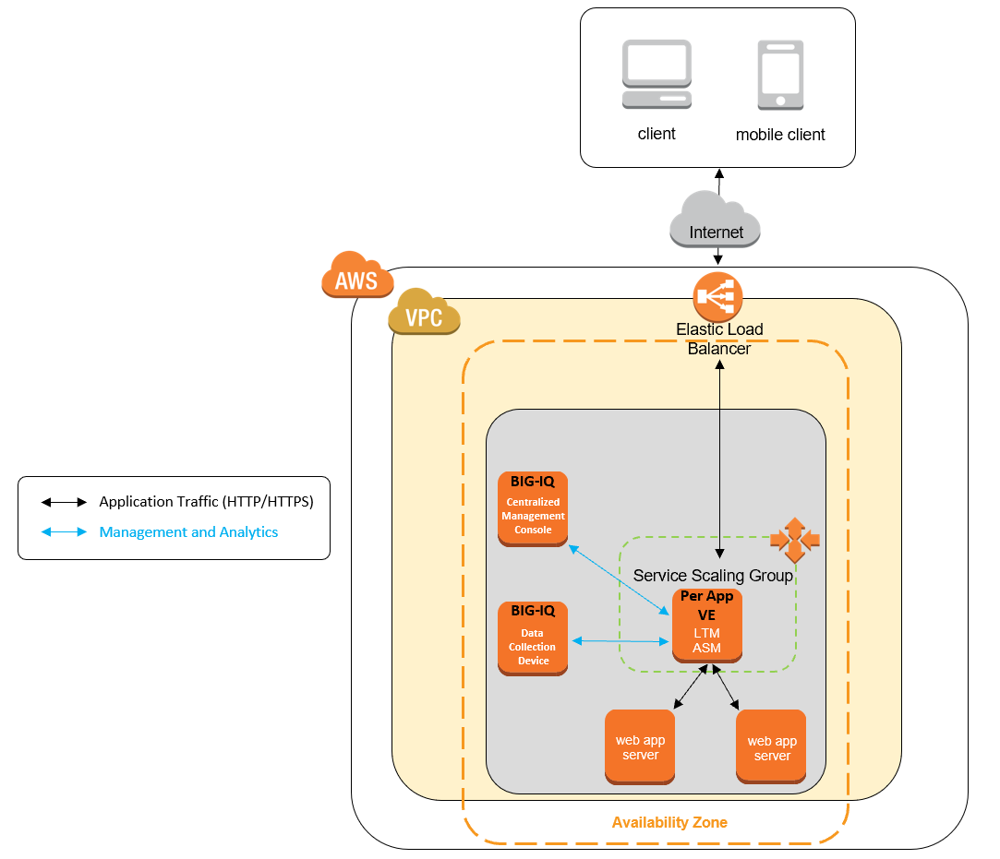

BIG-IP® Cloud Edition Trial Quick Start - AWS
=============================================

**Note:** Updated with BIG-IQ 6.1.0 and BIG-IP 14.1.0



Instructions for AWS
--------------------

To deploy this CFT in AWS, complete the following steps.

**Note:** This template is not supported in the Paris region and in AWS GovCloud.

1. To get a BIG-IQ trial license, go to [F5 Cloud Edition Trial](https://f5.com/products/trials/product-trials).

   Select **BIG-IP Cloud Edition - Advanced Web Application Firewall**

2. Subscribe and accept the Terms and Conditions for these F5 products:

   * [F5 BIG-IP Cloud Edition - (BYOL)](https://aws.amazon.com/marketplace/pp/B07DR2WGJJ)
   * [F5 BIG-IQ Virtual Edition - (BYOL)](https://aws.amazon.com/marketplace/pp/B00KIZG6KA)
   * [F5 BIG-IP VE - ALL (BYOL, 1 Boot Location)](https://aws.amazon.com/marketplace/pp/B07G5MT2KT)

3. Launch the *trial stack* template by right-clicking this button and choosing **Open link in new window**:

   <a href="https://console.aws.amazon.com/cloudformation/home?region=us-east-1#/stacks/new?stackName=F5-BIG-IP-CE-Trial&templateURL=https:%2F%2Fs3.amazonaws.com%2Fbig-iq-quickstart-cf-templates-aws%2F6.1.0%2Fbigiq-cm-dcd-pair-with-ssg.template" target="_blank"></a> (new VPC/demo app)

   <a href="https://console.aws.amazon.com/cloudformation/home?region=us-east-1#/stacks/new?stackName=F5-BIG-IP-CE-Trial&templateURL=https:%2F%2Fs3.amazonaws.com%2Fbig-iq-quickstart-cf-templates-aws%2F6.1.0.1%2Fbigiq-cm-dcd-pair-with-ssg-existing-vpc.template" target="_blank"></a> (existing VPC/no demo app)

4. In the CloudFormation Template (CFT), populate this information:

   * Stack name (must be fewer than 25 characters)
   * Subnets in each availability zone (AZ1 and AZ2) (ensure they are not the same)
   * If you did not do it previously, accept the BIG-IQ and BIG-IP license terms by visiting the URLs specified,
   clicking **Continue to Subscribe**, and accepting terms
   * BIG-IQ CM License Key (from F5 trial **BIG-IQ Console Node**)
   * BIG-IQ DCD License Key (from F5 trial **BIG-IQ Data Collection Device**)
   * BIG-IP WAF License Pool Key (from F5 trial **BIG-IP VE Trial, Adv WAF, Per App VE, 3 Instances**, used for the SSG)
   * SSH Key (your AWS key pair name)
   * SSG CloudFormation Stack Name (must be unique and fewer than 25 characters)

   *Expected time: ~5 min*

5. Open the [EC2 console](https://console.aws.amazon.com/ec2/v2/home) and wait until the BIG-IQ instances are fully deployed.

   * Instance State: running
   * Status Checks: 2/2 checks passed

   *Expected time: ~5 min*

6. Use admin user and your AWS SSH key to SSH into the BIG-IQ DCD instance, then execute the following commands:

   ```
   # bash
   # /config/cloud/setup-dcd.sh
   ```

   * When prompted, enter a password for BIG-IQ. You will use this same password again on the BIG-IQ CM instance. [Details on prohibited characters](https://support.f5.com/csp/article/K2873).
   * Let the scripts finish before moving to the next step.

   *Expected time: ~2 min*

7. Use admin user and your AWS SSH key to SSH into the BIG-IQ CM instance, then execute the following commands:

   ```
   # bash
   # /config/cloud/setup-cm.sh
   ```

   * Enter the [AWS access key ID/secret key](https://docs.aws.amazon.com/general/latest/gr/managing-aws-access-keys.html) (used for the Service Scaling Group object creation) and BIG-IQ password.
   * The password must match the password you used on the BIG-IQ DCD instance in the previous step.
   * Let the scripts finish before moving to the next step.

   *Expected time: ~30 min*
   
**Note:** the AWS access key ID/secret key requires full access permissions for the following AWS resources: Auto Scale Groups, Instances, SQS, S3, CloudWatch, and CloudFormation. Additionally, you need list, create, and delete permissions for the IAM role/rolePolicy/InstanceProfile. For quicker testing, assign a AdministratorAccess policy to your keys.

8a. **[new VPC/demo app CFT]** Open BIG-IQ CM in a web browser by using the public IP address with https, for example: ``https://<public_ip>``

   * Use the username `admin`.
   * Click the Applications tab > APPLICATIONS. An application demo protected with an F5 Web Application Firewall (WAF) is displayed.
   * You can manage the Service Scaling Group by clicking the Application tab > ENVIRONMENTS > Service Scaling Groups.

8b. **[existing VPC/no demo app CFT]** Open BIG-IQ CM in a web browser by using the public IP address with https, for example: ``https://<public_ip>``

   * Use the username `admin`.
   * You can manage the Service Scaling Group by clicking the Application tab > ENVIRONMENTS > Service Scaling Groups.
   * Click the Applications tab > APPLICATIONS. Create. Select `Default-AWS-f5-HTTPS-WAF-lb-template`.
       * **Name**: your application name
       * **Domain Names**: your application domain names (e.g. ELB DNS name)
       * **Environment**: select the available Service Scaling Group
       * **Name of Classic Load Balancer**: the name of your ELB (EC2 > Load Balancing > Load Balancers)
       * **Listeners**: your application ports (e.g. TCP/443 - TCP/443 and TCP/80 - TCP/80)
       * **Servers's IP Address**: your application server's IP addresses

For more information, go to [the BIG-IP Cloud Edition Knowledge Center](https://support.f5.com/csp/knowledge-center/software/BIG-IP?module=BIG-IP%20Cloud%20Edition).

Teardown instructions
---------------------
1. Open BIG-IQ CM in a web browser by using the public IP address, for example: ``https://<public_ip>``

   * Delete the application, under Applications tab > APPLICATIONS, select the application, then click Delete.

   *Expected time: ~5 min*

   * Delete the Service Scaling Group, under Application tab > ENVIRONMENTS > Service Scaling Groups, select the AWS SSG, then Delete.

   *Expected time: ~15 min*

2. Open the [Cloud Formation Console](https://console.aws.amazon.com/cloudformation/) and delete the stack.

   *Expected time: ~10 min*

Troubleshooting
---------------
1.  In BIG-IQ UI, if the application deployment failed, click Retry.
2.	In BIG-IQ UI, check BIG-IQ license on Console Node and Data Collection Device (System > THIS DEVICE > Licensing) and BIG-IP license pool (Devices > LICENSE MANAGEMENT > Licenses).
3.	In BIG-IQ UI, check the Cloud Environment if all the information are populated correctly (Applications > ENVIRONEMENTS > Cloud Environments).
4.	In BIG-IQ CLI, check following logs: /var/log/restjavad.0.log and /var/log/orchestrator.log.
5.	In AWS Marketplace, check if you have subscribed and accepted the terms for the F5 products.
6.	In AWS CFT Console, check the CFT status, make sure it is COMPLETED.
7.	In AWS IAM Console, confirm the Access Key has the necessary permissions.
8.	In AWS EC2 Console, check the Activity History in the Auto Scaling Group.

### Copyright

Copyright 2014-2018 F5 Networks Inc.

### License

#### Apache V2.0

Licensed under the Apache License, Version 2.0 (the "License"); you may not use
this file except in compliance with the License. You may obtain a copy of the
License at

http://www.apache.org/licenses/LICENSE-2.0

Unless required by applicable law or agreed to in writing, software
distributed under the License is distributed on an "AS IS" BASIS,
WITHOUT WARRANTIES OR CONDITIONS OF ANY KIND, either express or implied.
See the License for the specific language governing permissions and limitations
under the License.

#### Contributor License Agreement

Individuals or business entities who contribute to this project must have
completed and submitted the [F5 Contributor License Agreement](http://f5-openstack-docs.readthedocs.io/en/latest/cla_landing.html).
