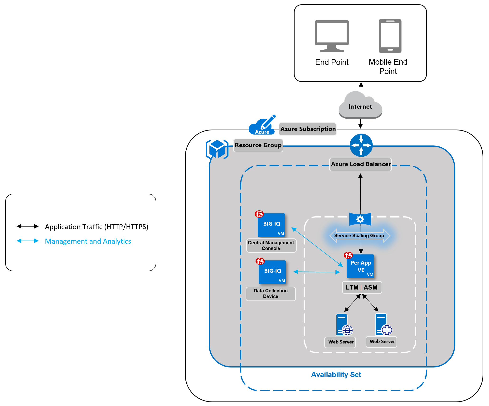

BIG-IP Cloud Edition Trial Quick Start - Azure
==============================================

**Note:** This template uses BIG-IQ 6.1.0 and BIG-IP 13.1.1

Instructions for Azure
----------------------

To deploy this ARM template in Azure cloud, complete the following steps.

**Note:** This template is not supported in the regions where Microsoft/insights is not available.

1. To get a BIG-IQ trial license, go to [F5 Cloud Edition Trial](https://f5.com/products/trials/product-trials).

   Select **BIG-IP Cloud Edition - Advanced Web Application Firewall**

2. Enable programmatic deployment for these F5 products:

   * F5 BIG-IQ Virtual Edition - (BYOL): [Navigate to Home > Marketplace > F5 BIG-IQ BYOL > Configure Programmatic Deployment](https://portal.azure.com/#blade/Microsoft_Azure_Marketplace/GalleryFeaturedMenuItemBlade/selectedMenuItemId/home/searchQuery/f5/resetMenuId/)
   * F5 BIG-IP VE - ALL (BYOL, 1 Boot Location): [Navigate to Home > Marketplace > F5 BIG-IQ BYOL > Configure Programmatic Deployment](https://portal.azure.com/#blade/Microsoft_Azure_Marketplace/GalleryFeaturedMenuItemBlade/selectedMenuItemId/home/searchQuery/f5/resetMenuId/)

3. Launch the *trial stack* template by right-clicking this button and choosing **Open link in new window**:

    (new VPC/demo app)
   
    (existing VPC/no demo app)
   
4. In the ARM Template, populate this information:

   * Resource group (select existing or create new)
   * Admin user name (default value is **azureuser**)
   * Authentication type (password or ssh key string)
   * Password / sshPublicKey for the BIG-IQ Data Collection Device (DCD) and Centralized Management (CM) instances (you will connect to the instances by using these credentials)
   * BIG-IQ password (management console's password)
   * Service principal secret (identity string created during app registration)
   * Azure client ID (under app registration, the Application ID)
   * License keys for CM, DCD, and BIG-IP 
   * Location (the default is the resource group's location; change if you want to deploy the resources in another location)
   * Service Scaling Group (SSG), DCD, and CM instance names (must be fewer than 25 characters)

5. Accept the terms and conditions and launch the cloud deployment. 

   *Expected time: ~30 min*

6. Open BIG-IQ CM in a web browser by using the public IP address with https, for example: ``https://<public_ip>``

   * Use the username `admin`.
   * Click the **Applications** tab > **APPLICATIONS**. An application demo protected with an F5 Web Application Firewall (WAF) is displayed.
   * You can manage the Service Scaling Group by clicking the **Applications** tab > **ENVIRONMENTS** > **Service Scaling Groups**.   

Security instructions
---------------------

1. F5 strongly recommends that you configure autoshutdown / whitelist the public IP addresses in the network security group you use to access the SSH port of the Azure instances. (This template deploys a network security group with ports 22, 80, and 443 open to the public.)

2. Avoid enabling the `root` account on publicly exposed Azure instances.

Tear down instructions
----------------------

1. If you want to preserve other resouces in the group, delete only the resources that were created. You can find these resources under **Resource Group** > **Deployments**. Otherwise, you can delete the entire resource group.
2. An SSG resource group was also created; it has SSG in its name. Find and delete this group.

Troubleshooting
---------------

1. In the BIG-IQ UI, if the application deployment failed, click **Retry**.
2. In the BIG-IQ UI, check the BIG-IQ license on Console Node and Data Collection Device (**System** > **THIS DEVICE** > **Licensing**) and the BIG-IP license pool (**Devices** > **LICENSE MANAGEMENT** > **Licenses**).
3. In the BIG-IQ UI, check the Cloud Environment to ensure all of the information is populated correctly (**Applications** > **ENVIRONMENTS** > **Cloud Environments**).
4. In the BIG-IQ CLI, check following logs: /var/log/setup.log, /var/log/restjavad.0.log and /var/log/orchestrator.log.
5. In the Azure Marketplace, ensure that programmatic deployment is enabled for F5 products.
6. In Azure Active Directory, ensure that app registration has the necessary permissions for API access, to delegate permissions to other users, and to add the users to the owner list of app registration.
7. Ensure you assigned the contributor role (RBAC) to the scope of the current resource/subscription associated with the app registration.
8. If you encountere a **MarketPurchaseEligibility** error while deploying the template, check the availability of BIG-IP and BIG-IQ. 
   
   For example, for BIG-IP:

   ``Get-AzureRmMarketplaceTerms -Publisher "f5-networks" -Product "f5-big-ip-byol" -Name "f5-big-all-1slot-byol" | Set-AzureRmMarketplaceTerms -Accept``

9. If the cloud provider test connection fails, ensure the service prinicpal associated with application has all requried permissions. If the cloud provider connection is still unsuccessful, restart the instances and check again.
10. When you deploy an application by using automated scripts, only one SSG is supported. To deploy more than one SSG and associate an application with it, follow the manual configuration process.
11. If you encounter the following error:

    ``"message":"Value 'ip10-azureinternal-f5' used in property 'properties.dnsSettings.domainNameLabel' of resource 'ubuntu-ip-xyz' (microsoft.network/publicipaddresses) is invalid``
    
    Edit the template to change the value under **loadBalancerDnsName** parameter of the **linkedTemplate**. (The deployment can fail when there is an existing public IP resource with same name.)

12. If you encouter the following error:

    ``Error {u'message': u"The subscription is not registered for the resource type 'components' in the location 'westus'. Please re-register for this provider in order to have access to this location.", u'code': u'MissingRegistrationForLocation'}``
    
    This is caused by recent changes in Azure Application Insight GA in some regions. Try to deploy the quickstart in different location.

### Copyright

Copyright 2014-2019 F5 Networks Inc.

### License

#### Apache V2.0

Licensed under the Apache License, Version 2.0 (the "License"); you may not use
this file except in compliance with the License. You may obtain a copy of the
License at

http://www.apache.org/licenses/LICENSE-2.0

Unless required by applicable law or agreed to in writing, software
distributed under the License is distributed on an "AS IS" BASIS,
WITHOUT WARRANTIES OR CONDITIONS OF ANY KIND, either express or implied.
See the License for the specific language governing permissions and limitations
under the License.

#### Contributor License Agreement

Individuals or business entities who contribute to this project must have
completed and submitted the [F5 Contributor License Agreement](http://f5-openstack-docs.readthedocs.io/en/latest/cla_landing.html).
